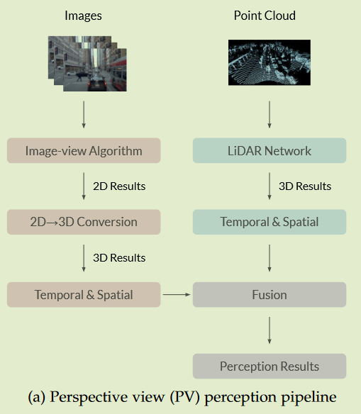
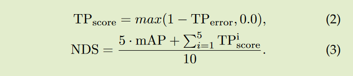

# Delving into the Devils of Bird’s-eye-view Perception: A Review, Evaluation and Recipe

Paper：http://arxiv.org/abs/2209.05324

Github：[OpenPerceptionX/BEVPerception-Survey-Recipe: Awesome BEV perception papers and cookbook for achieving SOTA results (github.com)](https://github.com/OpenPerceptionX/BEVPerception-Survey-Recipe)

### BEV优势

* 摄像头能识别较远距离；
* 能识别颜色；
* BEV能很好对不同模态进行融合；

### Camera-only 3D 感知

可以分为三个领域：单摄像头设置、立体设置和多摄像头设置，它们在解决深度问题方面具有不同的技能。

单目摄像头 3D 感知系统可以分为三个部分：2D 特征提取器、View Transform模块（从2D特征中预测深度信息；从 3D 空间中采样 2D 特征）和 3D 解码器。

#### 2D特征提取器

由于camera-only 3D 感知中的 2D 感知具有相同输入，因此一般特征提取器可以表述为：

其中$\mathcal{F}_{2D}$表示二维特征，$\mathcal{I}$表示图像，$M_{feat}$表示二维特征提取器（通常作为Backbone和 FPN）， $u, v$ 表示二维平面上的坐标， $*$表示一个或多个图像和相应的二维特征。

#### View Transform模块

视图变换在纯相机 3D 感知中起着至关重要的作用，因为它是构建 3D 信息和编码 3D 先验假设的主要模块。大体上可以分为两个方面，一是利用2D特征构造深度信息，将2D特征“提升”到3D空间，二是通过3D to 2D投影映射将2D特征编码到3D空间。将第一种方法命名为 2D-3D，将第二种方法命名为 3D-2D。这样的转换可以表述为：

 

其中 $\mathcal{F}_{3D}$表示 3D（或体素）特征， $x, y, z$ 表示 3D 空间中的坐标， $M_{trans}$ 表示视图变换模块， $\hat{u}, \hat{v}$ 表示根据 $x, y, z$ 的相应 2D 坐标（请注意，这可能会有所不同取决于特定的视图变换方法）， $\left[ \begin{matrix} R & T \end{matrix} \right] \tag{3}$和 $K$是相机外部和内部参数。

* 从 2D 到 3D，基于 LSS 的方法从 2D 特征预测每个像素的深度分布；而立体方法沿着由成本体积构建的平截头体分散 2D 特征；
* 从 3D 到 2D，基于单应矩阵的方法假定稀疏 3D 样本点并通过相机参数将它们投影到 2D 平面；纯基于网络的方法使用 MLP 或transformer对从 3D 空间到 2D 平面的投影矩阵进行隐式建模；

##### 2D-3D

LSS引入了 2D-3D 方法，它预测 2D 特征上每个网格的深度分布，然后通过相应的深度将每个网格的 2D 特征“提升”到体素空间，并按照基于 LiDAR 的方法执行下游任务.这个过程可以表述为：

其中 $D^∗(\hat{u}, \hat{v})$表示在 $\hat{u}, \hat{v}$ 处的预测深度值或分布，而 $\bigotimes$表示外部生产或类似操作。

在 LSS之后，还有另一项工作遵循将深度制定为 bin-wise 分布的相同想法，即 CaDDN。 CaDDN使用类似的网络来预测深度分布（分类深度分布），将体素空间特征压缩到BEV空间，最后进行3D检测。 LSS和 CaDDN的主要区别在于，CaDDN使用深度地面真值来监督其分类深度分布预测，因此具有优越的深度网络从 2D 空间中提取 3D 信息。声称“更好的深度网络”实际上是在特征级别学习路面和透视图之间的隐式投影。

##### 3D-2D

最近，3D-2D几何投影和神经网络的结合变得很流行，灵感来自于特斯拉发布的感知系统的技术路线图。请注意，变压器结构中的交叉注意机制在概念上满足了这种几何投影的需要，如表示为：

其中 $q, k, v$代表查询，键和值， $P_{xyz}$是体素空间中预定义的锚点。一些方法利用相机参数将 $P_{xyz}$ 投影到图像平面以实现模型的快速收敛。

#### 3D解码器

3D 解码器接收 2D/3D 空间中的特征并输出 3D 感知结果，如 3D 边界框、BEV 地图分割、3D 车道关键点等。大多数 3D 解码器来自基于 LiDAR 的方法，这些方法在体素空间/BEV 空间中执行检测，但仍然有一些仅相机的 3D 解码器利用 2D 空间中的特征（卷子识别3D物体）并直接回归 3D 对象的定位。

### Industrial Design of BEV Perception

如图 a 所示，对于透视图 (PV) 管道，LiDAR 轨迹直接生成 3D 结果。基于几何先验，图像的 3D 结果是从 2D 结果转换而来的。然后我们融合来自图像和 LiDAR 的预测，利用一些在现实场景中并不总是表现良好的手工方法；如图 b 所示，基于 BEV 的方法使用神经网络执行 2D 到 3D 转换并集成特征而不是来自不同模态的直接检测输出，从而减少手工设计并提高鲁棒性。

主要区别在于2D到3D的转换和融合模块。在 PV 感知管道 (a) 中，不同算法的结果首先被转换到 3D 空间，然后使用先验或手工规则进行融合。 BEV 感知管道 (b) 首先将 PV 特征转换为 BEV，然后融合特征以获得最终预测，从而保持大部分原始信息并避免手工设计。

首先，使用Backbone对输入数据进行编码，并通过transformer执行 BEV 投影。然后，BEV 特征在时间和空间上融合。最后，用不同的头解码 BEV 特征。每个设计都略有不同。 Tesla 将相机图像和 IMU 作为输入，而 Horizon 和 HAOMO 将点云作为输入。

#### Feature Extractor

特征提取器用于将原始数据转换为适当的特征表示，该模块通常由backbone和neck组成。

* Backbone：ResNet、RegNet……
* Neck：FPN、BiFPN……

#### PV to BEV Transformation

工业上主要有四种执行View Transform的方法：

1. 固定逆透视映射（IPM）。基于平坦地面假设，固定变换可以将 PV 特征投影到 BEV 空间。固定 IPM 投影可以很好地处理地平面。但是，它对车辆颠簸和道路平坦度很敏感。
2. 自适应 IPM 利用 自动驾驶车辆（SDV） 的外部参数，这些参数是通过一些姿态估计方法获得的，并将相应的特征投射到 BEV。尽管自适应 IPM 对车辆姿态具有鲁棒性，但它仍然基于平坦地面假设进行假设。
3. 基于 Transformer 的 BEV 转换使用密集的 transformer 将 PV 特征投射到 BEV 空间中。这种数据驱动的转换在没有事先假设的情况下运行良好。
4.  ViDAR 于 2018 年初由 Waymo 和 Mobileye 在不同的场地并行提出，表明基于相机或视觉输入使用像素级深度将 PV 特征投影到 BEV 空间的做法，类似于LiDAR 中的表示形式。术语 ViDAR 等同于大多数学术文献中提出的伪 LiDAR 概念。配备 ViDAR，可以将图像和随后的特征直接转换为点云。然后可以应用基于点云的方法来获得 BEV 特征。我们最近看到了很多 ViDAR 应用。

#### Fusion Module

不同相机源之间的对齐已经在之前的 BEV 转换模块中完成。在融合单元中，他们进一步聚合来自不同模态的 BEV 特征，最终集成到一个统一的形式中。

#### Temporal & Spatial Module

通过在时间和空间上堆叠 BEV 特征，可以构建特征队列。时间堆栈每隔固定时间推送和弹出一个特征块，而空间堆栈每隔固定距离执行一次。将这些堆栈中的特征融合成一种形式后，他们可以获得时空 BEV 特征，该特征对遮挡具有鲁棒性。聚合模块可以是 3D convolution、RNN 或 Transformer 的形式。基于时间模块和车辆运动学，可以维护一个大型 BEV 特征图围绕自我车辆并在本地更新特征图，就像特斯拉的空间 RNN 模块中所做的那样。

#### Prediction Head

在BEV感知中，多头设计被广泛采用。由于 BEV 特征聚合了来自所有传感器的信息，因此所有 3D 检测结果都从 BEV 特征空间解码。同时，一些设计中的PV结果（对自动驾驶仍然有价值）也从相应的PV特征中解码出来。预测结果可以分为三类：

* 低级结果与物理约束有关，例如光流、深度等
* 实体级结果包括对象的概念，即vehicle detection， laneline detection等
* 结构级结果表示对象之间的关系，包括对象跟踪、运动预测等

### Trick

#### Data Augmentation

2D的数据增强适用于基于camera的 BEV 感知任务。一般来说，可以将增强分为**仅涉及颜色变化的静态增强**和**四处移动像素的空间变换**。基于颜色变化的增强是直接适用的。对于涉及空间变换的增强，除了进行相应的地面真值变换外，还需要对相机参数进行校准。

最近工作中采用的常见增强是颜色抖动、翻转、多尺度调整大小、旋转、裁剪和网格掩码。参考BEVFormer++输入图像按 0.5 到 1.2 之间的因子缩放，按 0.5 的比例翻转；总面积的最大 30% 随机用方形遮罩遮盖。在 BEV 感知中有两种翻转图像的方法：

1. 简单地翻转图像、地面实况和相机参数。

2. 翻转图像顺序以保持图像之间重叠区域的连贯性，这类似于对称翻转整个 3D 空间。

### 补充：

pipeline：深度学习的操作流水线，从数据、模型、损失函数、优化、训练、推理整个流程。

LET-3D-APL：允许预测边界框的纵向定位误差达到给定的容差。 通过使用定位亲和力缩放精度来惩罚纵向定位错误。

其中 $pL(r)$ 表示纵向亲和力加权精度值， $p(r)$ 表示召回 r 时的精度值，乘数 $\bar{a}_l$是所有被视为 TP（真阳性）的匹配预测的平均纵向亲和力。

mAP： 类似于 2D 目标检测中众所周知的 AP 度量，但匹配策略从 IoU 替换为 BEV 平面上的 2D 中心距离。 AP是在不同的距离阈值下计算的：0.5、1、2和4米。

NDS：nuScenes 检测分数 (NDS) 是几个指标的组合：mAP、mATE（平均转换误差）、mASE（平均比例误差）、mAOE（平均方向误差）、mAVE（平均速度误差）和 mAAE（平均属性误差） . NDS 是通过使用上述指标的权重和来计算的。 mAP 的权重为 5，其余为 1。在第一步中，TPerror 被转换为 TPscore，如等式 1 所示。 2，然后等式3 定义了NDS：

