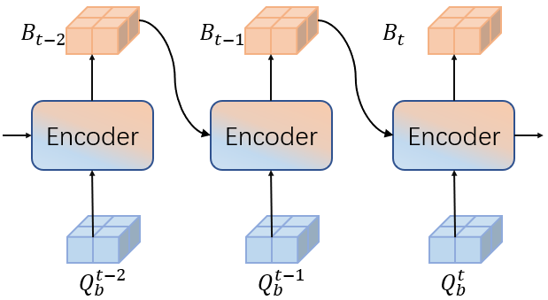
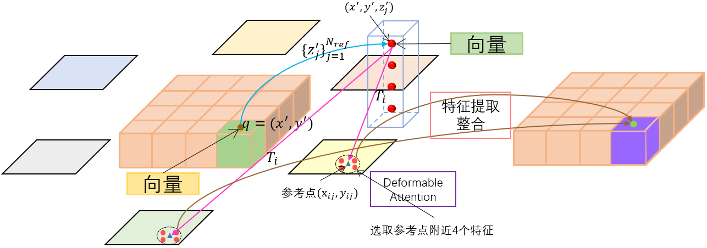
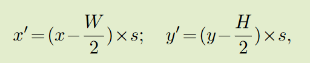
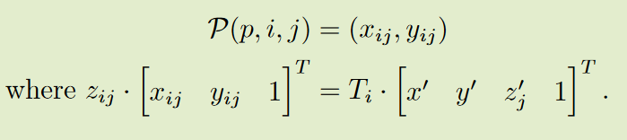
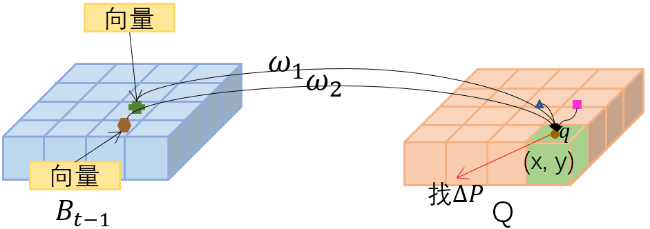
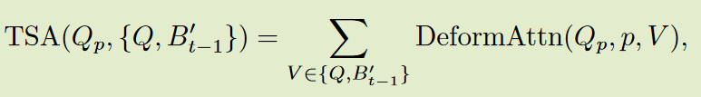

# BEVFormer

Paper: https://arxiv.org/pdf/2203.17270.pdf

Github: https://github.com/fundamentalvision/BEVFormer

### 总体框架

1. 在 t时间戳向backbone，输入多摄像头图像，得到不同摄像头视图的特征提取图 $F_t$；
2. 使用BEV查询 $Q$通过时间自注意力从先验BEV特征 $B_{t−1}$ 查询时间信息;
3. 通过空间交叉注意力，利用BEV查询向量 $Q$从多摄像机特征$F_t$中查询空间信息;
4. 再经过前馈网络后，编码器层输出细化的 BEV 特征同时生成当前BEV特征 $B_t$;
5. 经过 6 层叠加编码器，生成统一的当前时间戳 $t$ 的 BEV 特征 $B_t$

### BEV查询向量

预定义了一组网格形状的可学习参数 $Q\in\mathbb{R}^{H\times W\times C}$作为BEVFormer的查询向量，其中 $H, W$为 BEV 平面的空间形状。其中，位于 $Q$的  $p=(x, y)$处的查询 $Q_p\in\mathbb{R}^{1\times C}$负责BEV平面中对应的网格单元区域。

### 空间交叉注意力（SCA）

由于多摄像头三维感知的输入规模较大，普通的多头关注的计算成本极高。因此，采用高效的注意层。每个BEV查询向量 $Q_p$只与其跨摄像机视图的兴趣区域交互。

1. 将BEV平面上的每个查询向量$Q_p$通过投影函数$P$提升到一个柱状查询向量， 从柱状查询向量中采样 $N_{ref}$ 3D 参考点，然后将这些点投影到2D视图中。
2. 将命中视图称为 $V_{hit}$之后，我们将这些2D点作为查询 $Q_p$的参考点，并围绕这些参考点从命中视图 $V_{hit}$中抽取特征。
3. 对采样特征进行加权求和，作为空间交叉注意力的输出。

其中 $i$索引摄像机视图，$j$索引参考点，$N_{ref}$ 是每次 BEV 查询的总参考点。$F_{t}^i$是第 $i$个摄像头视图的特征。对于每一个BEV查向量询 $Q_p$, 我们使用一个投影函数 $P(p, i, j)$来得到第 $i$个视图图像上的第$j$个参考点。

#### 从投影函数 $P$中获得视图上的参考点并投影到视图上

1. 计算出 $Q$位于 $p = (x, y)$ 的查询向量 $Q_p$对应的真实世界位置 $(x^\prime,y^\prime)$

其中H, W为BEV查询向量的空间形状，s为BEV网格的分辨率大小，$(x^\prime,y^\prime)$为自我车位置为原点的坐标。

2. 预定义了一组高度锚点 $\{z^\prime_j\}^{N_{ref}}_{j=1}$以确保我们可以捕获出现在不同高度的线索。这样，对于每一个查询向量 $Q_p$，我们得到一个由3D参考点 $(x^\prime,y^\prime, z^\prime_j)^{N_{ref}}_{j=1}$组成的柱子。

3. 通过相机的投影矩阵将 3D 参考点投影到不同的图像视图上，可以写成:

这里，$P(p, i, j)$是第$j$个3D点 $(x^\prime,y^\prime, z^\prime_j)$投影到第 $i$个视图上的2D点$T_i\in\mathbb{R}^{3\times4}$是第 $i$个相机的已知投影矩阵。

### 时间注意力（TSA）

在时间自注意力中，每个 BEV 查询与两个特征交互：当前时间戳的 BEV 查询和前一个时间戳的 BEV 特征。

给定当前时间戳 $t$ 的BEV查询向量 $Q$ 和保存在时间戳 $t-1$ 的历史BEV特征 $B_{t-1}$ 我们首先根据ego-motion（自我运动）将 $B_{t-1}$ 与 $Q$ 对齐，使同一网格上的特征对应于相同的现实位置。在这里，我们表示对齐的历史BEV特征 $B_{t-1}$ 为 $B^\prime_{t-1}$ 。通过时间自注意力层对特征之间的这种时间联系进行建模，可以写成如下形式:

其中 $Q_p$ 表示位于 $p = (x, y)$ 的BEV查询向量。此外，与常规可变形注意力不同的 是，时间自注意力的偏移量 $\Delta{p}$ 由 $Q$ 和 $B^\prime_{t-1}$ 的连接来预测。特别地，对于每个序列的第一个样本，时间自注意力将退化为没有时间信息的自注意力，其中我们将BEV特征 $\{Q,  B^\prime_{t-1}\}$ 替换为重复的BEV查询向量 $\{Q,Q\}$ 。

### 3D detection

基于二维可变形[DETR](https://arxiv.org/pdf/2010.04159.pdf)探测器的端到端三维探测头。改进方法包括：

* 使用单尺度BEV特征 $B_t$ 作为解码器的输入;
* 预测三维检测框和速度而不是二维检测框;
* 仅使用 L1 损失监督三维检测框回归;

## 代码

### 输入数据格式

输入张量（bs，queue，cam，C，H，W），其中queue：连续帧个数；cam：每帧中视角图像数量。

## 补充

**自我运动**: 环境中相机的3D运动。在计算机视觉领域，自我运动是指估计相机相对于固定场景的运动。自我估计的一个例子是估计汽车相对于从汽车本身观察到的道路或街道标志线上的移动位置。自我运动的估计在自主机器人导航应用中很重要。https://blog.csdn.net/CSerwangjun/article/details/103154308

DeformableAttention：可变形注意力机制