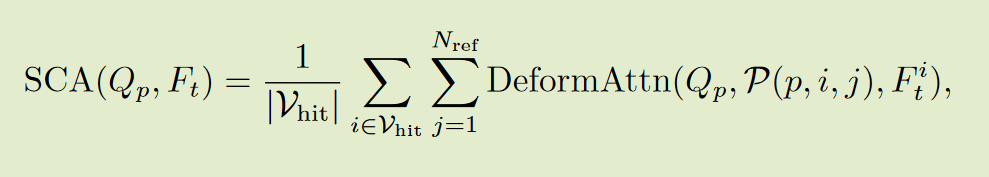

# BEVFormer

### 总体框架

1. 在 t时间戳向backbone，输入多摄像头图像，得到不同摄像头视图的特征提取图$F_t$；
2. 使用BEV查询$Q$通过时间自注意力从先验BEV特征$B_{t−1}$ 查询时间信息;
3. 通过空间交叉注意力，利用BEV查询向量$Q$从多摄像机特征$F_t$中查询空间信息;
4. 再经过前馈网络后，编码器层输出细化的 BEV 特征同时生成当前BEV特征$B_t$;

### BEV查询向量

预定义了一组网格形状的可学习参数 $Q\in\mathbb{R}^{H\times W\times C}$作为BEVFormer的查询向量，其中$H, W$为 BEV 平面的空间形状。其中，位于 $Q$的$p=(x, y)$处的查询$Q_p\in\mathbb{R}^{1\times C}$负责BEV平面中对应的网格单元区域。

### 空间交叉注意力

由于多摄像头三维感知的输入规模较大，普通的多头关注的计算成本极高。因此，采用高效的注意层。每个BEV查询向量$Q_p$只与其跨摄像机视图的兴趣区域交互。

首先将BEV平面上的每个查询向量提升到一个柱状查询向量， 从柱状查询向量中采样$N_{ref}$ 3D 参考点，然后将这些点投影到二维视图中。

将命中视图称为$V_{hit}$之后，我们将这些二维点作为查询$ Q_p $的参考点，并围绕这些参考点从命中视图 $ V_{hit} $中抽取特征。

最后，我们对采样特征进行加权和，作为空间交叉注意力的输出。

