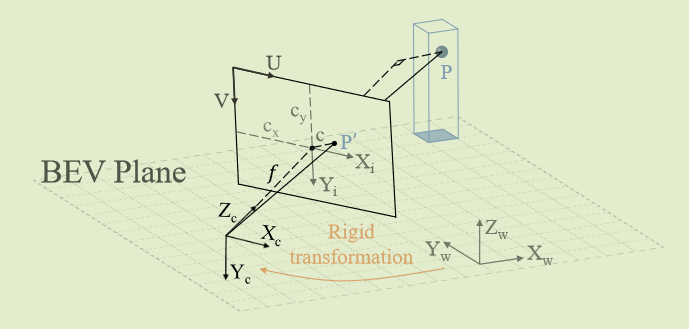
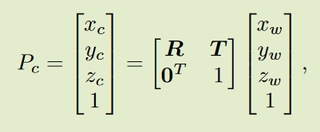
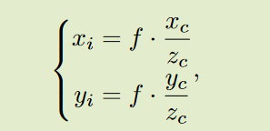
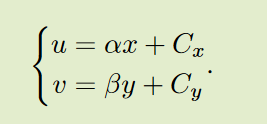
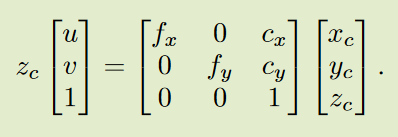
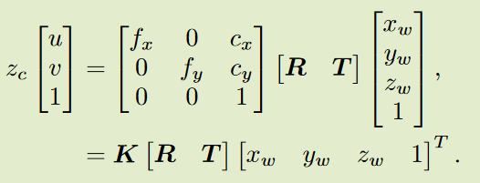

# 坐标变换

图像坐标：坐标中心为图像的中点，如上图c点；

像素坐标：坐标中心为图像的左上角；

从透视图到鸟瞰图 (BEV) 的视图转换。 $(X_w, Y_w, Z_w), (X_c, Y_c, Z_c)$表示世界坐标和相机坐标，$(X_i, Y_i), (U, V)$表示图像坐标和像素坐标。从 BEV 平面上举起一根柱子。 $P , P'$ 分别对应于柱子的 3D 点和相机视图的投影 2D 点。给定P的世界坐标和相机的内参数和外参数，就可以得到$P'$的像素坐标。

#### 1.  世界坐标->相机坐标

是刚性变换，只需要平移和旋转。令 $P_w = [x_w, y_w, z_w, 1], P_c = [x_c, y_c, z_c, 1]$ 分别是 3D 点 P 在世界坐标和相机坐标中的齐次表示。它们的关系可以描述如下：

其中$R、T$分别指旋转矩阵和平移矩阵。

#### 2. 相机坐标->图像坐标

在不考虑相机畸变的情况下，一个3D点和它在图像上的投影之间的关系可以简化为一个针孔模型。图像坐标$(x_i, y_i)$可以通过等式计算：

$\frac{f}{z_c}=\frac{x_i}{x_c}=\frac{y_i}{y_c}$

其中 $f$ 表示相机的焦距。

#### 3.图像坐标->像素坐标

图像坐标系与像素坐标系之间存在**平移**和**缩放**变换关系。设$\alpha$和$\beta$表示横坐标和纵坐标的比例因子，$c_x, c_y$表示坐标系原点的平移值。像素坐标$ (u, v)$ 在数学上由等式表示：

### 世界坐标->像素坐标

将2.和3.两式子合并，并设$f_x=\alpha{f}, f_y=\beta{f}$，相机坐标系到像素坐标系由等式表示：

综上所述，世界坐标系中的3D点P与其在像素坐标系中的投影P′的关系可以描述为：

矩阵$K=\left[ \begin{matrix} f_x & 0 & c_x\\ 0 & f_y & c_y \\ 0 & 0 & 1\end{matrix} \right] \tag{3}$称为**相机内参**，矩阵$\left[ \begin{matrix} R & T \end{matrix} \right] \tag{3}$称为**相机外参**。有了3D点的世界坐标，相机的内参和外参，图像视图上的投影可以通过上述变换得到。