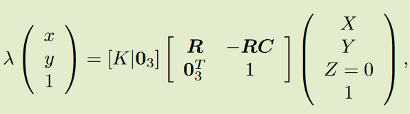
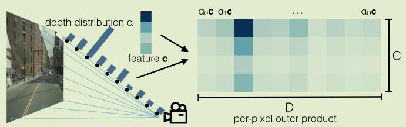
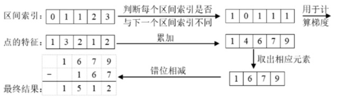
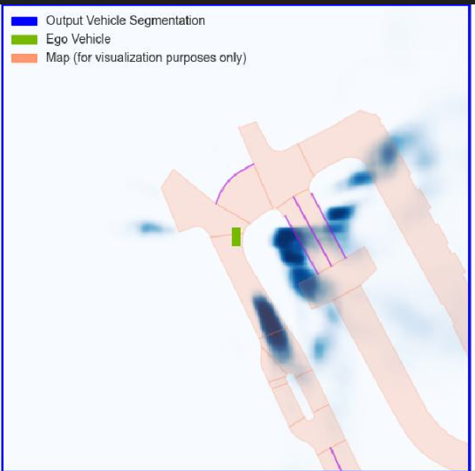

# Lift-Splat-Shoot

论文链接：https://arxiv.org/pdf/2008.05711.pdf；
Github仓库源码：https://github.com/nv-tlabs/lift-splat-shoot；

LSS是发表在ECCV 2020上的一篇论文，其主要是解决感知中的地图分割任务的，但其利用深度估计网络预测像素的离散深度，从而利用2D图像特征构建3D特征的思想被大多数感知算法借鉴。

LSS算法模型的前向过程主要包括以下五个部分：

* 构建相机视锥坐标下的3D空间网格，并利用相机的内外参变换矩阵将3D空间网格点投影到到BEV空间下；
* 利用主干网络和特征融合网络提取输入环视图片的2D图像特征；
* 利用深度估计网络预测特征图中每个单元格的语义信息和深度概率分布，通过外积运算构建相机视锥特征；
* 对投影到BEV空间下的坐标点以及相机视锥特征，利用体素池化（Voxel Pooling）构建BEV空间特征；
* 对输出的BEV特征利用BEV Encoder模块完成多尺度特征的提取和融合，将融合后的特征用于完成地图分割任务；

## 一、代码解释

**1. 构建相机视锥下的3D网格 + 空间点投影到BEV空间**

* 构建相机视锥下的3D网格，一种映射关系。其位置是基于图像坐标系的，同时锥点是图像特征上每个单元格映射回原始图像的位置。
```
def create_frustum(self):
	# make grid in image plane
	ogfH, ogfW = self.data_aug_conf['final_dim']  # 原始图像大小
	fH, fW = ogfH // self.downsample, ogfW // self.downsample  # 下采样16倍后图像大小  fH: 8  fW: 22
	# self.grid_conf['dbound'] = [4, 45, 1]  # 在深度方向上划分网格 ds: DxfHxfW (41x8x22)
	ds = torch.arange(*self.grid_conf['dbound'], dtype=torch.float).view(-1, 1, 1).expand(-1, fH, fW)
	D, _, _ = ds.shape  # D: 41 表示深度方向上网格的数量
	
	# 在0到351上划分22个格子 xs: DxfHxfW(41x8x22)
	xs = torch.linspace(0, ogfW - 1, fW, dtype=torch.float).view(1, 1, fW).expand(D, fH, fW)
	# 在0到127上划分8个格子 ys: DxfHxfW(41x8x22)
	ys = torch.linspace(0, ogfH - 1, fH, dtype=torch.float).view(1, fH, 1).expand(D, fH, fW)
	
	# D x H x W x 3
	# 堆积起来形成网格坐标, frustum[i,j,k,0]就是(i,j)位置，深度为k的像素的宽度方向上的栅格坐标   frustum: DxfHxfWx3
	frustum = torch.stack((xs, ys, ds), -1)
	return nn.Parameter(frustum, requires_grad=False)
```
* 获取特征提取后对应的车身坐标系。消除数据增强对映射视锥（3D网格）的影响，并将原图像坐标系（xs,  ys, ds）转为相机坐标，最后通过相机内外参转为ego坐标系（X，Y，Z）



```
def get_geometry(self, rots, trans, intrins, post_rots, post_trans):
	"""Determine the (x,y,z) locations (in the ego frame)
	of the points in the point cloud.
	Returns B x N x D x H/downsample x W/downsample x 3
	"""
	B, N, _ = trans.shape  # B: batch size N：环视相机个数
	
	# undo post-transformation
	# B x N x D x H x W x 3
	# 抵消数据增强及预处理对像素的变化
	points = self.frustum - post_trans.view(B, N, 1, 1, 1, 3)
	points = torch.inverse(post_rots).view(B, N, 1, 1, 1, 3, 3).matmul(points.unsqueeze(-1))
	
	# cam_to_ego
	# 见图2D->3D坐标系转换
	# 3: xs, ys, lamda(ds)->lamda * xs, lamda * ys, lamda
	points = torch.cat((points[:, :, :, :, :, :2] * points[:, :, :, :, :, 2:3], points[:, :, :, :, :, 2:3]), 5)
	combine = rots.matmul(torch.inverse(intrins))
	points = combine.view(B, N, 1, 1, 1, 3, 3).matmul(points).squeeze(-1)
	points += trans.view(B, N, 1, 1, 1, 3)
	# point B x N x D x H x W x 3 -> X, Y, Z
	
	return points
```

**2. 利用主干网络和特征融合网络提取环视图像的2D图像特征**

* 其中LSS原论文中采用的主干网络是EfficientNet-B0，其输出的多尺度特征如下
```
level0 = Tensor([bs * N, 16, H / 2, W / 2])
level1 = Tensor([bs * N, 24, H / 4, W / 4])
level2 = Tensor([bs * N, 40, H / 8, W / 8])
level3 = Tensor([bs * N, 112, H / 16, W / 16])
level4 = Tensor([bs * N, 320, H / 32, W / 32])
```
* 对提取的后两层进行多尺度特征特征融合
```
Step1: 对最后一层特征升采样到倒数第二层大小
level4 -> Up -> level4' = (bs * N, 320, H / 16, W / 16)

Step2：对主干网络输出的后两层特征进行concat
cat(level4', level3) -> output = (bs * N, 432, H / 16, W / 16)

Step3：对concat后的特征，利用卷积层进一步拟合
ConvLayer(output) -> output' = (bs * N, 512, H / 16, W / 16)

其中ConvLayer = 
"""/Sequential(
  (0): Conv2d(432, 512, kernel_size=(3, 3), stride=(1, 1), padding=(1, 1), bias=False)
  (1): BatchNorm2d(512, eps=1e-05, momentum=0.1, affine=True, track_running_stats=True)
  (2): ReLU(inplace=True)
  (3): Conv2d(512, 512, kernel_size=(3, 3), stride=(1, 1), padding=(1, 1), bias=False)
  (4): BatchNorm2d(512, eps=1e-05, momentum=0.1, affine=True, track_running_stats=True)
  (5): ReLU(inplace=True)
)"""
```
* 利用深度估计网络预测特征图中每个单元格的语义信息和深度概率分布，通过外积运算构建相机视锥特征
主要思想是设计了一个深度估计网络对特征图每个单元格的语义信息（通道维度）和深度信息（深度方向的概率分布）进行预测
```
步骤整体pipeline
output' -> Conv1x1 -> x = (bs * N, 105, H / 16, W / 16)

步骤输出的特征：
output = Tensor[(bs * N, 512, H / 16, W / 16)]

步骤使用的1x1卷积层：
Conv1x1 = Conv2d(512, 105, kernel_size=(1, 1), stride=(1, 1))

步骤输出的特征以及对应的物理含义：
x = Tensor[(bs * N, 105, H / 16, W / 16)] 
第二维的105个通道分成两部分；
第一部分：前41个维度代表不同深度上41个离散深度；
第二部分：后64个维度代表特征图上的不同位置对应的语义特征；
```
* 对估计计出来的41个离散深度利用softmax()函数计算深度方向的概率密度
* 通过外积运算的方式，将2D的图像特征投影到3D的视锥特征，从而完成2D特征到3D特征的视角转换
```
# 深度方向的概率密度
depth = (bs * N, 41, H / 16, W / 16) -> unsqueeze -> (bs * N, 1, 41, H / 16, W / 16)

# c)步骤得到的特征，选择后64维是预测出来的语义特征
x[:, self.D:(self.D + self.C)] = (bs * N, 64, H / 16, W / 16) -> unsqueeze(2) -> (bs * N, 64, 1 , H / 16, W / 16)

# 概率密度和语义特征做外积，构建图像特征点云
new_x = depth.unsqueeze(1) * x[:, self.D:(self.D + self.C)].unsqueeze(2)  # (bs * N, 64, 41, H / 16, W / 16)
```

2D到3D部分的转换实现逻辑如下图所示（其中α ，c分别代表深度估计网络预测出来的深度概率密度以及语义特征信息）



**3. 利用体素池化根据BEV空间下的坐标点以及视锥特征构建BEV空间特征**

* Voxel Pooling前的准备

```
def voxel_pooling(self, geom_feats, x):
    # geom_feats；(B x N x D x H x W x 3)：在ego坐标系下的坐标点；
    # x；(B x N x D x fH x fW x C)：图像点云特征

    B, N, D, H, W, C = x.shape
    Nprime = B*N*D*H*W 

    # 将特征点云展平，一共有 B*N*D*H*W 个点
    x = x.reshape(Nprime, C) 

    # flatten indices
    geom_feats = ((geom_feats - (self.bx - self.dx/2.)) / self.dx).long() # ego下的空间坐标转换到体素坐标（计算栅格坐标并取整）
    geom_feats = geom_feats.view(Nprime, 3)  # 将体素坐标同样展平，geom_feats: (B*N*D*H*W, 3)
    batch_ix = torch.cat([torch.full([Nprime//B, 1], ix,
                             device=x.device, dtype=torch.long) for ix in range(B)])  # 每个点对应于哪个batch
    geom_feats = torch.cat((geom_feats, batch_ix), 1)  # geom_feats: (B*N*D*H*W, 4)

    # filter out points that are outside box
    # 过滤掉在边界线之外的点 x:0~199  y: 0~199  z: 0
    kept = (geom_feats[:, 0] >= 0) & (geom_feats[:, 0] < self.nx[0])\
        & (geom_feats[:, 1] >= 0) & (geom_feats[:, 1] < self.nx[1])\
        & (geom_feats[:, 2] >= 0) & (geom_feats[:, 2] < self.nx[2])
    x = x[kept]
    geom_feats = geom_feats[kept]

    # get tensors from the same voxel next to each other
    ranks = geom_feats[:, 0] * (self.nx[1] * self.nx[2] * B)\
         + geom_feats[:, 1] * (self.nx[2] * B)\
         + geom_feats[:, 2] * B\
         + geom_feats[:, 3]  # 给每一个点一个rank值，rank相等的点在同一个batch，并且在在同一个格子里面
    sorts = ranks.argsort()
    x, geom_feats, ranks = x[sorts], geom_feats[sorts], ranks[sorts]  # 按照rank排序，这样rank相近的点就在一起了
   
    # cumsum trick
    if not self.use_quickcumsum:
        x, geom_feats = cumsum_trick(x, geom_feats, ranks)
    else:
        x, geom_feats = QuickCumsum.apply(x, geom_feats, ranks)

    # griddify (B x C x Z x X x Y)
    final = torch.zeros((B, C, self.nx[2], self.nx[0], self.nx[1]), device=x.device)  # final: bs x 64 x 1 x 200 x 200
    final[geom_feats[:, 3], :, geom_feats[:, 2], geom_feats[:, 0], geom_feats[:, 1]] = x  # 将x按照栅格坐标放到final中

    # collapse Z
    final = torch.cat(final.unbind(dim=2), 1)  # 消除掉z维

    return final  # final: bs x 64 x 200 x 200
```

这里在原始论文中主要采用了quick sum的方式计算BEV特征，其实现逻辑的图例如下（图例来自https://zhuanlan.zhihu.com/p/567880155）。说白了就是错位找2同值的位置，做累加

```
class QuickCumsum(torch.autograd.Function):
    @staticmethod
    def forward(ctx, x, geom_feats, ranks):
        x = x.cumsum(0) # 求前缀和
        kept = torch.ones(x.shape[0], device=x.device, dtype=torch.bool)  
        kept[:-1] = (ranks[1:] != ranks[:-1])  # 筛选出ranks中前后rank值不相等的位置

        x, geom_feats = x[kept], geom_feats[kept]  # rank值相等的点只留下最后一个，即一个batch中的一个格子里只留最后一个点
        x = torch.cat((x[:1], x[1:] - x[:-1]))  # x后一个减前一个，还原到cumsum之前的x，此时的一个点是之前与其rank相等的点的feature的和，相当于把同一个格子的点特征进行了sum

        # save kept for backward
        ctx.save_for_backward(kept)

        # no gradient for geom_feats
        ctx.mark_non_differentiable(geom_feats)

        return x, geom_feats
```



**4. 对输出的BEV特征利用BEV Encoder模块完成多尺度特征的提取和融合，融合后的特征用于完成地图分割任务；**

* BEV Encoder提取BEV特征后输出的多尺度特征如下

```
level0：Tensor([bs, 64, 100, 100])
level1: Tensor([bs, 128, 50, 50])
level2: Tensor([bs, 256, 25, 25])
```

* 对输出的多尺度特征进行融合，得到最终的BEV特征，完成最后的地图分割任务

```
Step1: level2 -> Up (4x) -> level2' = (bs, 256, 100, 100)
Step2: concat(level2', level0) -> output = (bs, 320, 100, 100)
Step3: Conv1(output) -> output' = (bs, 256, 100, 100)

''' Conv1
Sequential(
  (0): Conv2d(320, 256, kernel_size=(3, 3), stride=(1, 1), padding=(1, 1), bias=False)
  (1): BatchNorm2d(256, eps=1e-05, momentum=0.1, affine=True, track_running_stats=True)
  (2): ReLU(inplace=True)
  (3): Conv2d(256, 256, kernel_size=(3, 3), stride=(1, 1), padding=(1, 1), bias=False)
  (4): BatchNorm2d(256, eps=1e-05, momentum=0.1, affine=True, track_running_stats=True)
  (5): ReLU(inplace=True)
)'''

Step4: Up2(output') -> final = (bs, 1, 200, 200)
'''Sequential(
  (0): Upsample(scale_factor=2.0, mode=bilinear)
  (1): Conv2d(256, 128, kernel_size=(3, 3), stride=(1, 1), padding=(1, 1), bias=False)
  (2): BatchNorm2d(128, eps=1e-05, momentum=0.1, affine=True, track_running_stats=True)
  (3): ReLU(inplace=True)
  (4): Conv2d(128, 1, kernel_size=(1, 1), stride=(1, 1))
)'''
```

## 二、改进方向

1. 存在残影；

   

2. 直接采用16倍特征提取进行映射是否可行；

3. **BEV的图像适合卷积吗？采用更大的感受野效果如何？**

4. **对$\lambda$ （文章中的$\alpha$）能否采用监督学习的方式；**

5. **将2D的image特征提取引入到BEV_enconder中优化；**

